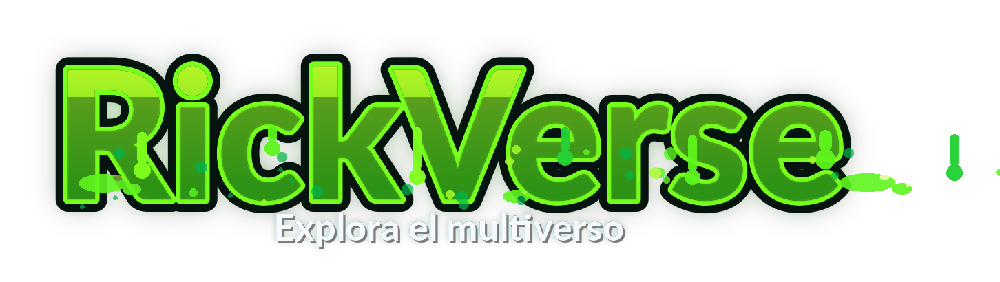
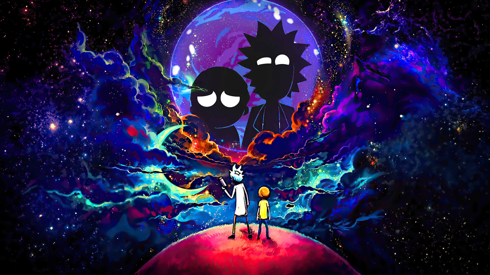

<div align="center">


<h1>RickVerse</h1>

<p><strong>RickVerse — Aplicación móvil dedicada a la serie Rick and Morty.</strong></p>

<p>


</p>

<p>
<a href="https://skillicons.dev"></a>
</p>

</div>

Aplicación móvil dedicada a la serie **Rick and Morty**, desarrollada con **Flutter** como proyecto académico de la materia **Introducción al Desarrollo de Aplicaciones Móviles**.

---

## Información académica

| Campo | Detalle |
|-------|--------|
| **Materia** | Introducción al Desarrollo de Aplicaciones Móviles |
| **Profesor** | Amadis Suárez Genao |
| **Alumno** | Christian Gil |
| **Matrícula** | 2012-1036 |

---

## Descripción del proyecto

Desarrollen una aplicación móvil dedicada a una serie, película o canal de YouTube. Asegúrense de que su aplicación incluya las siguientes vistas:

### Portada

La pantalla de inicio incluye un **carrusel (slider)** con imágenes de la serie, el logo de RickVerse superpuesto y un menú de acceso rápido a las demás secciones de la app.

### Personajes

Se consultan personajes desde la **Rick and Morty API**. La lista muestra al menos tres personajes con nombre, estado y especie. Al seleccionar uno se abre la vista de detalle con foto, estado, especie, tipo, género, origen, ubicación y cantidad de episodios.

### Momentos

Tres momentos favoritos con imagen y título. En el detalle se muestra la descripción completa y un **reproductor de YouTube integrado** (`youtube_player_iframe`) que reproduce el video dentro de la app.

### Acerca de

Vista con imagen de portada, descripción de la serie, tipo de obra, **creadores** (Justin Roiland y Dan Harmon), **cantidad de temporadas**, año de estreno y tema principal.

### Juega Conmigo

Mini-juego de **adivinanza de personajes** (estilo ahorcado). Se muestra la imagen de un personaje aleatorio de la API, pistas de especie/género e intentos limitados. Incluye teclado de letras, marcador de aciertos/fallos y racha.

Referencia de ejemplo: [adamix.net/tareas/itla2](https://adamix.net/tareas/itla2/)

### Contrátame

Tarjeta de perfil con **foto**, nombre, matrícula y enlaces de contacto (correo, teléfono, GitHub y LinkedIn).

---

## Capturas de pantalla

Coloca aquí las capturas de la app en funcionamiento. Se recomienda guardarlas en la carpeta `docs/screenshots/`.

| Portada | Personajes |
|:------:|:---------:|
|  |  |
| *Pantalla de inicio con carrusel* | *Listado de personajes* |

| Detalle personaje | Momentos |
|:----------------:|:--------:|
|  |  |
| *Foto y datos del personaje* | *Momentos favoritos* |

| Detalle momento | Juega conmigo |
|:--------------:|:-------------:|
|  |  |
| *Detalle con video integrado* | *Mini-juego de adivinanza* |

| Acerca de | Contrátame |
|:--------:|:---------:|
|  |  |
| *Información de la serie* | *Datos de contacto y foto* |

> **Nota:** Si aún no has agregado las imágenes, crea la carpeta `docs/screenshots/` y sustituye los archivos `01_portada.png` … `08_contratame.png` por tus capturas reales.

---

## Funcionalidades principales

- Navegación inferior con **MainShell** (Inicio, Juega conmigo, Acerca de, Perfil).
- Navigator anidado en la pestaña Inicio para mantener la barra al navegar a Personajes y Momentos.
- Diseño **responsive** para móvil, tablet y web (`Responsive`, `ResponsiveContent`).
- Tema oscuro con paleta inspirada en Rick and Morty.
- Consumo de datos desde la [Rick and Morty API](https://rickandmortyapi.com/).

---

## Estructura del proyecto

```text
lib/
├── core/
│   ├── constants/       # Colores, assets, API, YouTube
│   ├── routes/          # Rutas nombradas
│   ├── theme/           # Tema Material 3
│   ├── utils/           # Utilidades responsive
│   └── widgets/         # Reproductor YouTube, mensajes de error
├── data/
│   ├── models/          # CharacterModel, MomentModel
│   └── services/        # RickAndMortyService
├── features/
│   ├── about/           # Acerca de
│   ├── characters/      # Personajes y detalle
│   ├── game/            # Juega conmigo
│   ├── hire_me/         # Contrátame
│   ├── home/            # Portada y MainShell
│   └── moments/         # Momentos y detalle
├── app.dart
└── main.dart

assets/images/           # Imágenes locales (logo, momentos, perfil)
docs/screenshots/        # Capturas de pantalla para el README
```

---

## Requisitos previos

<p align="center">
  <a href="https://flutter.dev" title="Flutter"></a>
  <a href="https://dart.dev" title="Dart"></a>
  <a href="https://developer.android.com" title="Android"></a>
  <a href="https://www.google.com/chrome/" title="Chrome"></a>
  <a href="https://git-scm.com" title="Git"></a>
</p>

| Requisito | Descripción |
|-----------|-------------|
| **Flutter SDK** | Versión 3.x — [Instalación](https://docs.flutter.dev/get-started/install) |
| **Dart** | 3.x con null safety |
| **Plataforma** | Emulador/dispositivo Android, navegador Chrome o escritorio Windows |
| **Red** | Conexión a internet para la Rick and Morty API y videos de YouTube |

---

## Instrucciones de uso

### 1. Instalar dependencias

```bash
flutter pub get
```

### 2. Ejecutar la aplicación

```bash
# Dispositivo/emulador conectado o Chrome
flutter run

# Web
flutter run -d chrome

# Android
flutter run -d android
```

### 3. Ejecutar pruebas y análisis

```bash
flutter analyze
flutter test
```

---

## Tecnologías utilizadas

<p align="center">
  <a href="https://skillicons.dev"></a>
</p>

| Tecnología | Uso | Icono |
|-----------|-----|-------|
| **Flutter / Dart** | Framework y lenguaje de la aplicación |  |
| **Material 3** | Interfaz de usuario |  |
| **http** | Consumo de [Rick and Morty API](https://rickandmortyapi.com/) |  |
| **youtube_player_iframe** | Reproducción de videos dentro de la app |  |
| **url_launcher** | Enlaces de contacto en Contrátame |  |

> Iconos generados con [Skill Icons](https://skillicons.dev/).

---

## Autor

- **Nombre:** Christian Gil
- **Matrícula:** 2012-1036

---

## Créditos

<div align="center">



<br /><br />



<p><em>Imagen del carrusel de portada — RickVerse</em></p>

</div>

Proyecto desarrollado como parte de la materia **Introducción al Desarrollo de Aplicaciones Móviles**, impartida por el profesor **Amadis Suárez Genao**.

La serie **Rick and Morty** es propiedad de sus respectivos creadores y distribuidores. Esta aplicación es un proyecto académico sin fines comerciales.

---

## Licencia

Este proyecto se distribuye bajo la licencia MIT.
